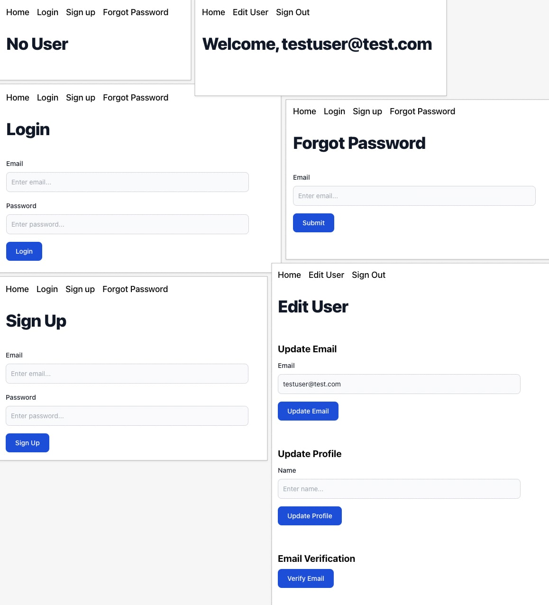

# Firebase Auth JWT - React 

- [x] React
- [x] TypeScript
- [x] Vite
- [x] Firebase
- [x] Tailwind CSS / SASS
- [x] React Router DOM
- [x] React Toastify

### Set Up

Install dependencies 
```
npm install
``` 

Run dev server 
```
npm run dev
``` 

Preview production build 
```
npm run build && npm run preview
``` 

### Firebase App Configuration

Create `.env` from `.env.example` 

```
cp .env.example .env
```

Replace variables with [firebase console](https://console.firebase.google.com/) app configuration values

`VITE_FB_API_KEY=""`
`VITE_FB_AUTH_DOMAIN=""`
`VITE_FB_PROJECT_ID=""`
`VITE_FB_STORAGE_BUCKET=""`
`VITE_FB_MESSAGING_SENDER_ID=""`
`VITE_FB_APP_ID=""` 

### Roadmap 

- [x] Sign Up
- [x] Login
- [x] Sign Out
- [x] Password Reset
- [x] Update Email
- [x] Update Profile
- [x] Verify Email 

